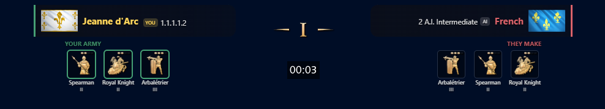
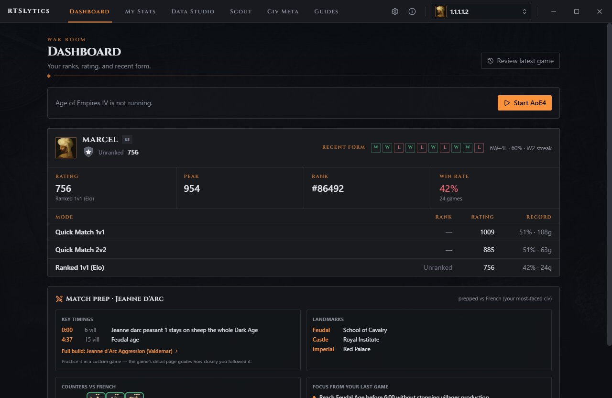
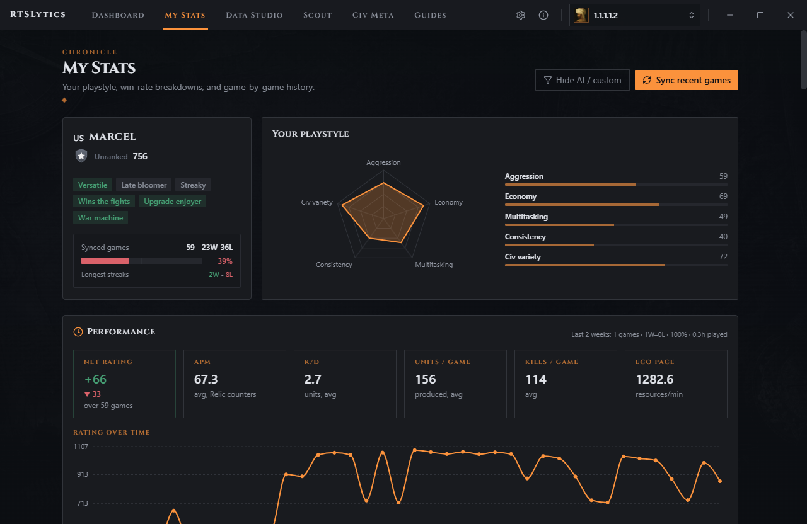
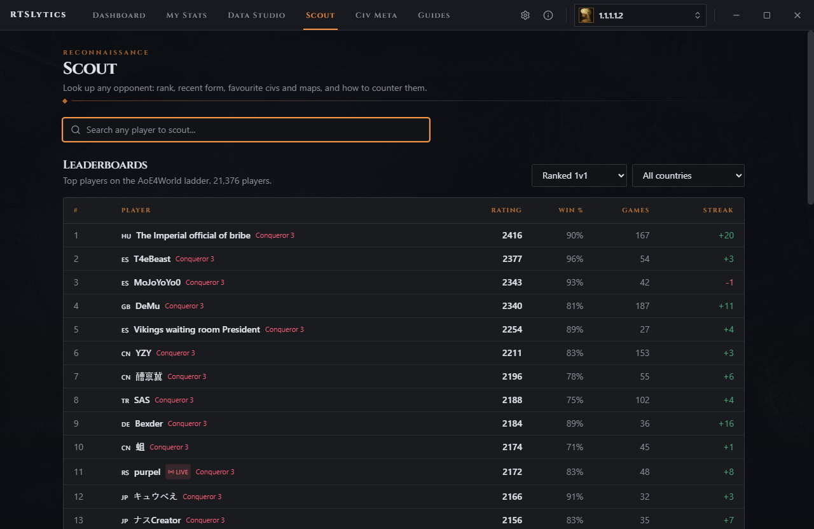
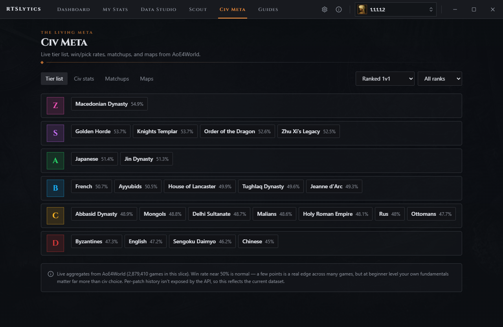
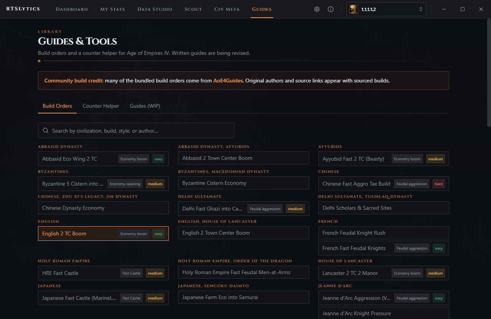
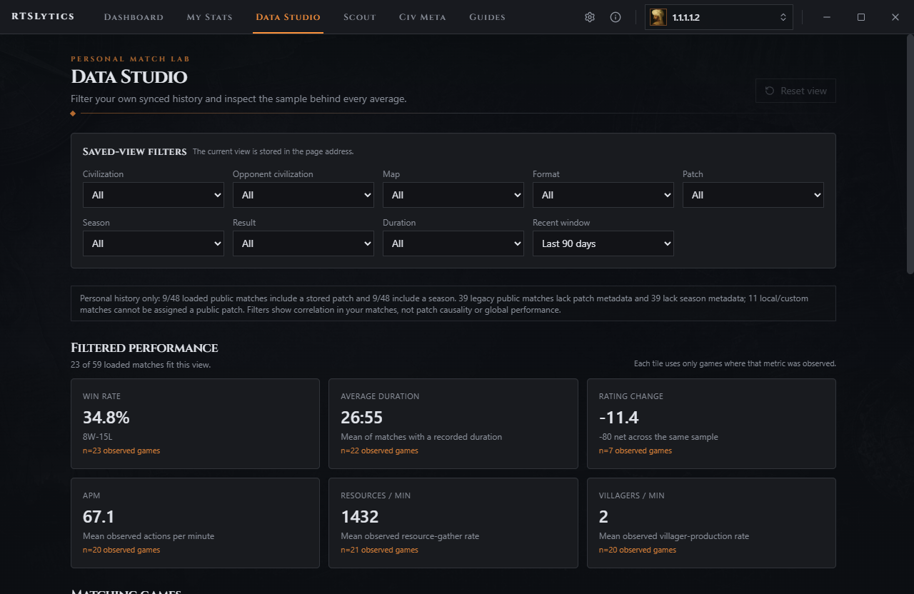

# RTSLytics

  

AoE4 companion for scouting, an in-game overlay, and post-game stats.

**[Download RTSLytics v0.6.1 for Windows](https://github.com/tbhtho/AOE4-Analytics/releases/download/v0.6.1/RTSLytics-0.6.1-portable.exe)** and run `RTSLytics-0.6.1-portable.exe`. No installer is required. [Release notes and SHA-256 checksum](https://github.com/tbhtho/AOE4-Analytics/releases/tag/v0.6.1).

   
  <b>In-game overlay</b> - civilizations, army units, counters, and match time

<table>
  <tr>
    <td width="50%"> <b>Dashboard</b> - ranks, rating, recent form, match prep</td>
    <td width="50%"> <b>My Stats</b> - playstyle radar, performance, rating over time</td>
  </tr>
</table>

More screenshots: Scout, Civ Meta, Guides, and Data Studio

<table>
  <tr>
    <td width="50%"> <b>Scout</b> - ladder leaderboard and opponent lookup</td>
    <td width="50%"> <b>Civ Meta</b> - tier list and win rates from AoE4World</td>
  </tr>
  <tr>
    <td width="50%"> <b>Guides</b> - community build orders and counter helper</td>
    <td width="50%"> <b>Data Studio</b> - filter your own match history</td>
  </tr>
</table>

## Get started

Select your player profile, then use **Borderless or Windowed Fullscreen** in AoE4 for the overlay. **Alt + O** shows or hides it; **Ctrl + Alt + O** enters widget placement. Rebind both in Settings. Windows is required for the overlay and local-file features. [More controls and setup](docs/PROJECT_DETAILS.md#overlay-controls).

## Features

- **Scout and prepare:** opponent ranks, ratings, recent form, favorite civilizations, public matches, exact personal head-to-head history, and practical team roles based on the civilization lineup.
- **Live overlay:** matchup bar, civ flags, ranks, key units and counters, rating-based win odds for rated ranked 1v1s, optional live APM, and a session record with net rating.
- **Follow a plan:** pin community build orders in Guides; build-order steps and age-up pace targets for your rank follow your local game clock, including pauses. Adaptive Build Coach gives conditional in-match responses and evidence-linked post-game recovery plans.
- **Review each game:** result card, Turning-Point Story, economy grade, APM, trends, and raw team contribution breakdowns. Benchmark Lens compares recent stretches and filtered samples with sample sizes shown for every metric.
- **Explore your data:** Matchup Lab separates global directional data from personal results, each with sample counts. Data Studio filters by civilization, opponent civilization, map, format, patch, season, result, duration, and time window, with bookmarkable views.
- **Learn and play:** civilization pages, tier lists, counters, build orders, landmarks, and matchup stats. Local support covers ranked, Quick Match, custom games, and vs-AI where files provide the data; written guides remain work in progress.

Community build orders are adapted from [AoE4Guides](https://aoe4guides.com/); the app credits original authors and links to each source.

## Data and optional Steam connection

RTSLytics reads your own AoE4 logs, history, and replay headers under `Documents\My Games\Age of Empires IV`, alongside public data from AoE4World and Relic. It does not modify the game.

Optional Steam sign-in retrieves your own ranked economy and age-up summaries from Relic and its summary host. QR approval is recommended. Password sign-in sends your password only to Steam for that login and does not store it; saved session tokens use OS encryption. [Connection details and data limits](docs/PROJECT_DETAILS.md#data-and-optional-steam-connection).

## Documentation

[Feature guide and controls](docs/PROJECT_DETAILS.md) · [Development and contribution](CONTRIBUTING.md) · [Third-party notices](NOTICE)

## License and credits

RTSLytics' own source code uses the [MIT License](LICENSE). Bundled AoE4 game data and images are © Microsoft and used for non-commercial purposes under Microsoft's Game Content Usage Rules. These assets are not covered by MIT; see [NOTICE](NOTICE).

RTSLytics is not affiliated with Microsoft, Relic Entertainment, or World's Edge. Age of Empires IV and related assets belong to Microsoft.
